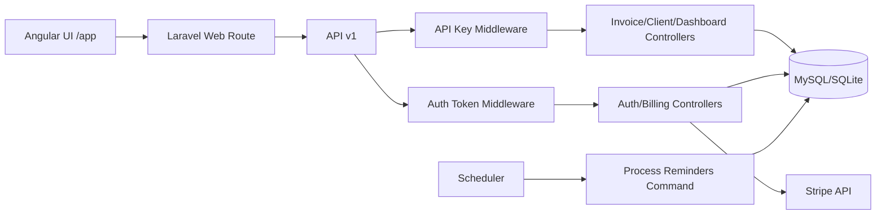

# RecoverFlow (Laravel + Angular)

RecoverFlow is a micro-SaaS for agencies and freelancers to recover overdue invoice payments.

It combines:
- invoice tracking and reminder automation
- API-key based tenant access
- auth + Stripe subscription billing
- an Angular admin console for daily operations

---

## 1. Problem This Project Solves

Small businesses lose cashflow because invoices get paid late or never paid.

RecoverFlow solves this by giving teams a system to:
- create clients and invoices quickly
- automatically schedule reminder cadences (day 0, 3, 7, 14)
- mark invoices paid and stop pending reminders
- track overdue/outstanding/recovered amounts
- monetize access through recurring subscription plans

---

## 2. Revenue Model

Built-in pricing model in config:
- `starter`: `$29/mo`
- `growth`: `$79/mo`
- `scale`: `$199/mo`

Each plan maps to:
- API quota limit
- Stripe price ID

When checkout succeeds, the user plan is updated and API key quotas are synced.

Configuration file:
- [config/recoverflow.php](/Users/prashantgautam/Herd/passwordgenerator/config/recoverflow.php)

---

## 3. High-Level Architecture

Core layers:
- Presentation: Angular app served at `/app`
- API layer: Laravel controllers under `App\Http\Controllers\Api\V1`
- Domain services: reminder scheduling/processing + Stripe checkout wrapper
- Data layer: Eloquent models + migrations
- Background processing: scheduler triggers reminder processor

---

## 4. Main Components

### Backend API
- Auth: [AuthController.php](/Users/prashantgautam/Herd/passwordgenerator/app/Http/Controllers/Api/V1/AuthController.php)
- Billing: [BillingController.php](/Users/prashantgautam/Herd/passwordgenerator/app/Http/Controllers/Api/V1/BillingController.php)
- Recovery domain:
  - [ClientController.php](/Users/prashantgautam/Herd/passwordgenerator/app/Http/Controllers/Api/V1/ClientController.php)
  - [InvoiceController.php](/Users/prashantgautam/Herd/passwordgenerator/app/Http/Controllers/Api/V1/InvoiceController.php)
  - [DashboardController.php](/Users/prashantgautam/Herd/passwordgenerator/app/Http/Controllers/Api/V1/DashboardController.php)

### Middleware
- API key validation + quota: [EnsureValidApiKey.php](/Users/prashantgautam/Herd/passwordgenerator/app/Http/Middleware/EnsureValidApiKey.php)
- User bearer token auth: [EnsureAuthenticatedUserToken.php](/Users/prashantgautam/Herd/passwordgenerator/app/Http/Middleware/EnsureAuthenticatedUserToken.php)
- Aliases wired in: [bootstrap/app.php](/Users/prashantgautam/Herd/passwordgenerator/bootstrap/app.php)

### Domain Services
- Reminder scheduling: [InvoiceReminderScheduler.php](/Users/prashantgautam/Herd/passwordgenerator/app/Services/InvoiceReminderScheduler.php)
- Reminder processing: [InvoiceReminderProcessor.php](/Users/prashantgautam/Herd/passwordgenerator/app/Services/InvoiceReminderProcessor.php)
- Stripe checkout + webhook signature verification: [StripeCheckoutService.php](/Users/prashantgautam/Herd/passwordgenerator/app/Services/StripeCheckoutService.php)

### Frontend
- Angular app root logic: [resources/ui/src/app/app.ts](/Users/prashantgautam/Herd/passwordgenerator/resources/ui/src/app/app.ts)
- UI template: [resources/ui/src/app/app.html](/Users/prashantgautam/Herd/passwordgenerator/resources/ui/src/app/app.html)
- Styling: [resources/ui/src/app/app.css](/Users/prashantgautam/Herd/passwordgenerator/resources/ui/src/app/app.css)

---

## 5. Data Model

Primary entities:
- `users`: account owner + billing status + Stripe IDs
- `user_api_tokens`: hashed bearer tokens for auth APIs
- `api_keys`: tenant key, plan, quota, usage counters
- `clients`: customer records per API key
- `invoices`: invoice ledger per client
- `invoice_reminders`: scheduled/sent/skipped reminder events

Migrations:
- [create_users_table.php](/Users/prashantgautam/Herd/passwordgenerator/database/migrations/0001_01_01_000000_create_users_table.php)
- [create_api_keys_table.php](/Users/prashantgautam/Herd/passwordgenerator/database/migrations/2026_03_03_165732_create_api_keys_table.php)
- [create_clients_table.php](/Users/prashantgautam/Herd/passwordgenerator/database/migrations/2026_03_03_165732_create_clients_table.php)
- [create_invoices_table.php](/Users/prashantgautam/Herd/passwordgenerator/database/migrations/2026_03_03_165732_create_invoices_table.php)
- [create_invoice_reminders_table.php](/Users/prashantgautam/Herd/passwordgenerator/database/migrations/2026_03_03_165733_create_invoice_reminders_table.php)
- [create_user_api_tokens_table.php](/Users/prashantgautam/Herd/passwordgenerator/database/migrations/2026_03_03_171810_create_user_api_tokens_table.php)
- [add_user_id_to_api_keys_table.php](/Users/prashantgautam/Herd/passwordgenerator/database/migrations/2026_03_03_171810_add_user_id_to_api_keys_table.php)
- [add_billing_columns_to_users_table.php](/Users/prashantgautam/Herd/passwordgenerator/database/migrations/2026_03_03_171810_add_billing_columns_to_users_table.php)

---

## 6. API Surface

Registered routes:
- [routes/api.php](/Users/prashantgautam/Herd/passwordgenerator/routes/api.php)

### Auth APIs (`/api/v1/auth/*`)
Authentication mechanism: `Authorization: Bearer <auth_token>`

- `POST /register`
- `POST /login`
- `GET /me`
- `POST /logout`

### Billing APIs (`/api/v1/billing/*`)

- `POST /checkout-session` (Bearer token required)
- `POST /webhook` (Stripe webhook)

### Recovery APIs (`/api/v1/*`)
Authentication mechanism: `X-Api-Key: rf_live_...`

- `GET /dashboard`
- `GET /clients`
- `POST /clients`
- `GET /clients/{client}`
- `GET /invoices`
- `POST /invoices`
- `GET /invoices/{invoice}`
- `POST /invoices/{invoice}/mark-paid`

---

## 7. Core Business Flows

### A) Account and tenant bootstrapping
1. User registers.
2. Backend creates user auth token.
3. Backend creates default API key for tenant.
4. UI stores both tokens in local storage.

### B) Invoice recovery flow
1. Create client.
2. Create invoice.
3. System auto-schedules 4 reminders.
4. Scheduler runs reminder processor.
5. Sent reminders update invoice activity.
6. Marking invoice paid skips pending reminders.

### C) Billing flow
1. Authenticated user starts checkout for a plan.
2. Backend creates Stripe checkout session.
3. Stripe redirects payment flow.
4. Webhook `checkout.session.completed` updates user plan.
5. API key quotas are synchronized to new plan.

---

## 8. Angular UI Routing/Serving Notes

Laravel serves Angular from `/app` using a catch-all route in:
- [routes/web.php](/Users/prashantgautam/Herd/passwordgenerator/routes/web.php)

Special handling included:
- static asset lookup in `public/app` and `public/app/browser`
- fallback to SPA `index.html`
- explicit MIME mapping for `.js`, `.css`, `.json`, `.map`, `.svg`, `.ico`

Build output command:
- `cd resources/ui && npm run build:laravel`

---

## 9. Console Commands and Scheduler

Commands:
- `php artisan recoverflow:create-api-key "Tenant Name" --plan=starter --quota=5000`
- `php artisan recoverflow:process-reminders --limit=100`

Scheduler registration:
- [routes/console.php](/Users/prashantgautam/Herd/passwordgenerator/routes/console.php)

Production worker example:
- `php artisan schedule:work`

---

## 10. Environment Configuration

Key `.env` values:
- `STRIPE_SECRET`
- `STRIPE_WEBHOOK_SECRET`
- `STRIPE_PRICE_STARTER`
- `STRIPE_PRICE_GROWTH`
- `STRIPE_PRICE_SCALE`
- `RECOVERFLOW_AUTH_TOKEN_TTL_DAYS`
- `RECOVERFLOW_CHECKOUT_SUCCESS_URL`
- `RECOVERFLOW_CHECKOUT_CANCEL_URL`

Reference template:
- [.env.example](/Users/prashantgautam/Herd/passwordgenerator/.env.example)

---

## 11. Local Runbook

1. `composer install`
2. `cp .env.example .env`
3. `php artisan key:generate`
4. `php artisan migrate --no-interaction`
5. `cd resources/ui && npm install && npm run build:laravel`
6. Open `http://passwordgenerator.test/app` (Laravel Herd)

---

## 12. Test Coverage

Feature tests implemented:
- auth + billing: [AuthBillingApiTest.php](/Users/prashantgautam/Herd/passwordgenerator/tests/Feature/AuthBillingApiTest.php)
- invoice recovery API: [InvoiceRecoveryApiTest.php](/Users/prashantgautam/Herd/passwordgenerator/tests/Feature/InvoiceRecoveryApiTest.php)
- reminder processing command: [ProcessInvoiceRemindersCommandTest.php](/Users/prashantgautam/Herd/passwordgenerator/tests/Feature/ProcessInvoiceRemindersCommandTest.php)

Run tests:
- `php artisan test --compact`

---

## 13. Deploy (Render Blueprint)

This repository now includes:
- [Dockerfile](/Users/prashantgautam/Herd/passwordgenerator/Dockerfile)
- [render.yaml](/Users/prashantgautam/Herd/passwordgenerator/render.yaml)
- [docker/start-web.sh](/Users/prashantgautam/Herd/passwordgenerator/docker/start-web.sh)

Deploy steps:
1. Push this repo to GitHub.
2. In Render, click **New +** -> **Blueprint**.
3. Select your repo and deploy.
4. In the created `recoverflow-web` service, set these required env vars:
   - `APP_KEY` (Laravel key, e.g. output of `php artisan key:generate --show`)
   - `STRIPE_SECRET`
   - `STRIPE_WEBHOOK_SECRET`
   - `STRIPE_PRICE_STARTER`
   - `STRIPE_PRICE_GROWTH`
   - `STRIPE_PRICE_SCALE`
5. Redeploy once after setting Stripe values.

What happens automatically:
- PostgreSQL database is provisioned from `render.yaml`.
- Migrations run on startup (`php artisan migrate --force`).
- Angular UI is built into `public/app` during Docker build.
- Scheduler starts inside the web container (`schedule:work`).
- PHP web server boots with a custom router so `/app` is routed correctly.

Post-deploy checks:
- Open `https://<render-domain>/app`
- Test register/login, create client/invoice, and billing checkout flow.
- Configure Stripe webhook endpoint:
  - `https://<render-domain>/api/v1/billing/webhook`

---

## 14. Current Limitations

- Reminder delivery is stateful simulation (status updates) and does not yet send real email/SMS.
- Auth is custom token table (not Sanctum/Passport).
- Stripe webhook currently handles core subscription events only.
- Angular UI is single-page dashboard without role-based access separation.
